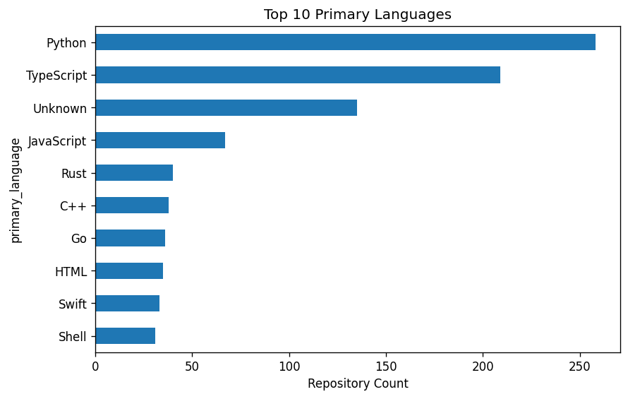
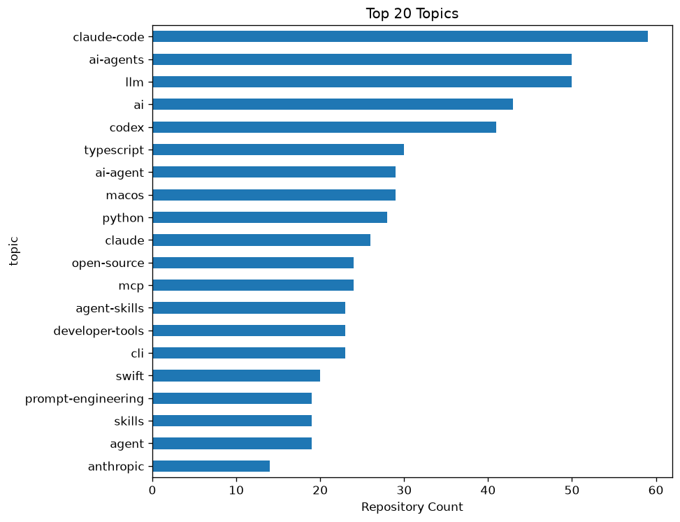
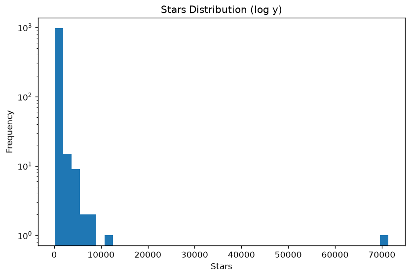
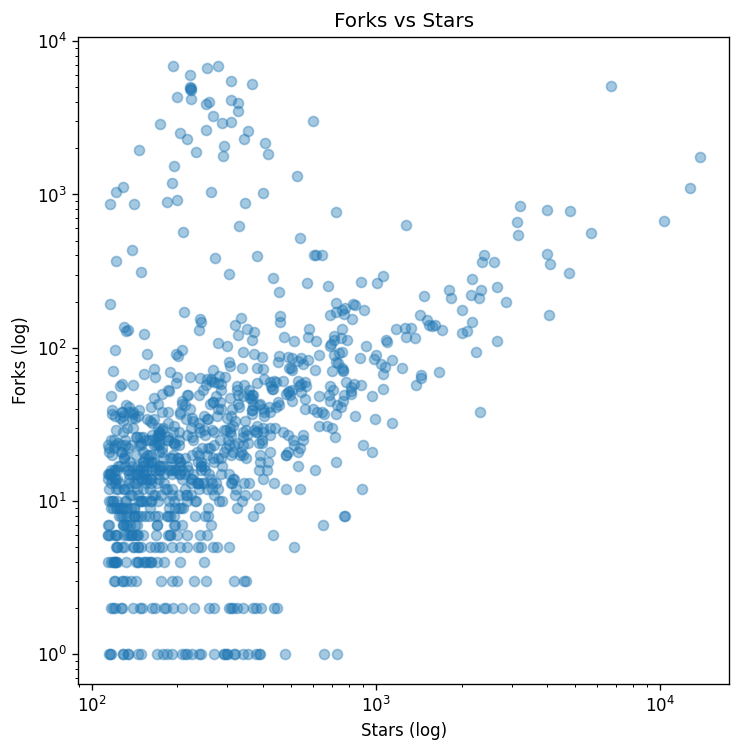
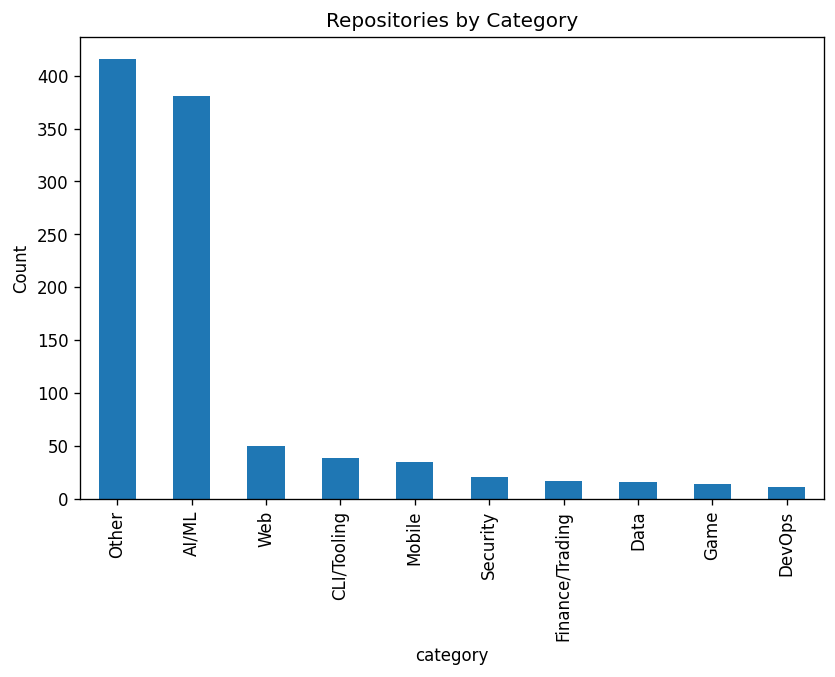
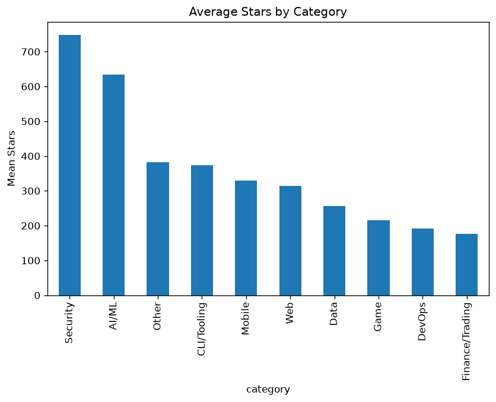
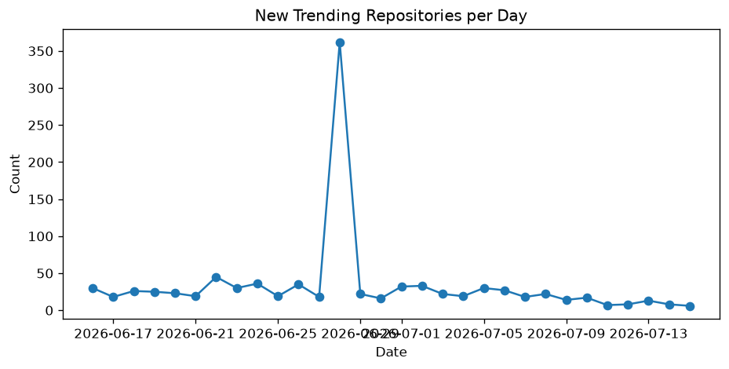

# 📊 GitHub 近一個月開源趨勢分析

> 抓取 GitHub 最近 30 天新建立的熱門 repository，用規則式分類器歸類並做視覺化分析，**並獨家加入「vibe-coding 水分專案」嚴格檢測**。

<p align="center">
  
  
  
  
  
</p>

---

## 📑 目錄

- [一句話總結](#一句話總結)
- [🎯 三個關鍵發現](#-三個關鍵發現)
- [🚨 原創貢獻：Vibe-Coding 水分專案分析](#-原創貢獻vibe-coding-水分專案分析)
- [📊 完整圖表結果](#-完整圖表結果)
- [⚙️ 快速開始](#️-快速開始)
- [🏗️ 架構](#️-架構)
- [📁 檔案結構](#-檔案結構)
- [⚠️ 已知限制](#️-已知限制)
- [📜 授權](#-授權)

---

## 一句話總結

> 在 999 個近月熱門 GitHub repo 中，**77.7% 落在 AI/ML 或 Other 兩大桶**、Stars↔Forks 相關性只有 0.36（中度），而**1.8% 屬於「水分專案」**（高 stars 但內容空虛），集中在 1000-5000 stars 級距。

---

## 🎯 三個關鍵發現

### 1️⃣ 2026 開源 trending 是**雙峰結構**：AI 與長尾

| 分類 | 比例 |
|---|---:|
| Other（無法歸類） | 42.0% |
| **AI/ML** | **35.7%** |
| Web | 7.9% |
| Mobile + CLI + Game + Security + DevOps + Data | 14.4% |

→ AI 與「沒打標籤的長尾」加起來占四分之三。其餘 7 個傳統類別合計不到 25%。

### 2️⃣ Stars 與 Forks 的相關性沒想像中強

- Pearson **0.36** / Spearman **0.43** — 中度正相關
- 平均 stars **492** vs 中位數 **228** — 平均被少數爆紅專案拉抬 **2.2 倍**
- → 結論用中位數比平均數更貼近真實

### 3️⃣ AI/ML 類 fork:star ratio 只有 17%（全類別最低）

| 類別 | 平均 stars | 平均 forks | fork:star |
|---|---:|---:|---:|
| Web | 329 | **410** | 124% |
| Other | 426 | 201 | 47% |
| DevOps | 315 | 159 | 50% |
| **AI/ML** | **609** | **103** | **17%** |

→ 「被星但沒人用」是 AI 類專案的典型模式，這也是下一節 vibe-coding 分析的核心問題。

---

## 🚨 原創貢獻：Vibe-Coding 水分專案分析

### 動機

GitHub trending 充滿了**「stars 很多但實質很少」**的 repo —— 沒有 description、沒有 license、沒有 topics、forks 與 stars 嚴重失衡。我們把這類專案稱為 **vibe-coding garbage**（水分專案）：

> **定義**：一個 repo 的 stars 遠超它的可見實質。標籤針對的是公開產出，不是作者本人，也不是 vibe-coding 這個編程方式本身。

### 嚴格評分機制（0-10 分）

| 訊號 | 加分 | 理由 |
|---|---:|---|
| description 完全空白 | +2 | 低用心度的最強單一訊號 |
| description 少於 20 字 | +1 | 輕度 |
| 沒設 license | +1 | 開源實踐疏忽 |
| stars > 1000 且 description 空 | +2 | 「famous nothing」 |
| stars > 500 且 fork:star < 2% | +2 | 被星但沒人 fork |
| stars/day > 300 且 age < 7 天 | +1 | 隔夜暴衝可疑 |
| 名字含 generic AI buzzword | +1 | `*-skills`, `*-agent`, `*-cookbook` … |
| 沒任何 topics | +1 | 標籤習慣缺失 |

**判定**：0-2 legitimate · 3-4 suspicious · **5+ garbage**

### 結果

| 等級 | 數量 | 比例 |
|---|---:|---:|
| 🟢 Legitimate | 849 | 85.0% |
| 🟡 Suspicious | 132 | 13.2% |
| 🔴 **Garbage** | **18** | **1.8%** |

### 🎯 核心發現：farming 集中在 1000-5000 stars 級距

| Stars 級距 | 樣本 | Garbage % |
|---|---:|---:|
| ≥10000 | 3 | 0.0% |
| 5000-9999 | 2 | 50.0% (樣本小) |
| **1000-4999** | **71** | **9.9%** ← 集中區 |
| 500-999 | 108 | 1.9% |
| 100-499 | 815 | 1.0% |

> 太高（≥10000）會被嚴格盯，太低（<500）沒人在乎，**中段 1k-5k 是 farming 的甜蜜點**：夠 impressive 上 trending，又不會被嚴格審視。

### Top 7 最可疑專案

| Rank | Repo | Stars | Forks | Age | 分數 |
|---:|---|---:|---:|---:|---:|
| 1 | `thananon/9arm-skills` | 1918 | 255 | 3d | **8** |
| 2 | `cursor/cookbook` | 3843 | 446 | 26d | **7** |
| 3 | `deepseek-ai/awesome-deepseek-agent` | 2145 | 234 | 26d | **7** |
| 4 | `FoundZiGu/GuJumpgate` | 2143 | 612 | 4d | **6** |
| 5 | `wrongly-cuddly-obsession/NTSB_FOIA_MU5735` | 1070 | 366 | 23d | **6** |
| 6 | `V4bel/dirtyfrag` | 4752 | 755 | 16d | **6** |
| 7 | `Ch1rpy2613/Mirrai` | 806 | 11 | 18d | **6** |

> 注意名單中也包含 `cursor/cookbook`、`deepseek-ai/awesome-*` 等**官方帳號** —— 並非惡意 farming，而是 2026 AI 公司「先發再說」的快速出貨文化縮影。

完整報告：[`outputs/vibe_coding_analysis.md`](outputs/vibe_coding_analysis.md)

---

## 📊 完整圖表結果

### 1. 熱門程式語言（前 10）



**怎麼看**：每一條代表一種主要程式語言在近月熱門新專案中出現的次數。
**重點**：Python 一馬當先（34%），TypeScript / JavaScript 緊追，C/C++/Rust/Go/Swift 形成第二梯隊。前 3 名加總已占約 63%。

### 2. 熱門主題標籤（前 20）



**怎麼看**：topic 是專案作者自貼的標籤。`claude-code` (52)、`ai-agents` (43)、`llm` (34)、`claude` (29)、`mcp` (26)、`codex` (25) 霸榜，印證 2026 上半年仍是 LLM / AI agent 應用爆炸期。也藏一個 `trading-bot` / `polymarket` 的金融自動化小爆紅。

⚠️ **注意**：**54.4% 的 repo 完全沒貼任何 topic**，這是這份資料的結構性問題。

### 3. Stars 分布（直方圖 + 對數座標）



**怎麼看**：Y 軸是對數，意思是相隔一格代表 10 倍差距。長尾愈長代表少數爆紅專案拉開差距。
**重點**：絕大多數熱門 repo 集中在 100-1000 stars 區間，>10000 只有 3 個（nexu-io/open-design、antirez/ds4、Yuan1z0825/nature-skills）。

### 4. Stars vs Forks 散佈圖



**怎麼看**：每點是一個 repo，兩軸都是對數。對角線方向走就代表 stars 和 forks 一起長。
**重點**：呈現中度正相關（Pearson 0.36），但散佈面積大 —— **stars 高 ≠ forks 一定高**。AI/ML 類有明顯一群「stars 高但 forks 偏低」的點。

### 5. 專案分類分布



**怎麼看**：用關鍵字規則歸類後的結果。優先順序：AI/ML > Security > DevOps > Data > Web > Mobile > Game > CLI/Tooling > Other。
**重點**：Other (420) + AI/ML (357) = 77.7%，極度雙峰。

### 6. 各類別平均 Stars



**怎麼看**：每類別的平均 stars 比較。
**重點**：Game 平均最高 (754)，但被 antirez/ds4 異常值拉抬，看中位數較中肯。Data (12 個樣本) 中位數最高 (316)，少而精。

### 7. 每日新增熱門 repo 數（30 天時序）



**怎麼看**：當日有幾個「最終熱門起來」的 repo 在這天建立。
**重點**：每天平均約 4 個，最高 10 個，沒有明顯爆量 —— 熱門專案是「持續產出」而非集中於某波發表會。

---

## ⚙️ 快速開始

### 前置需求

- Python 3.14+
- GitHub Personal Access Token（只需 `public_repo` 讀取權限）

### 安裝

```powershell
# 1. clone 後進入專案目錄
git clone <repo-url> github_recent_trend_analysiz
cd github_recent_trend_analysiz

# 2. 建虛擬環境並安裝依賴
python -m venv .venv
.venv\Scripts\Activate.ps1
pip install -e ".[dashboard,dev]"

# 3. 設定 GitHub Token（產一個：https://github.com/settings/tokens）
cp .env.example .env
# 編輯 .env，填入 GITHUB_TOKEN=ghp_xxx
```

### 跑完整 pipeline（約 35-40 分鐘，含 GitHub API 抓取）

```powershell
# Stage 1-4：抓 search + languages + topics，產 CSV
.venv\Scripts\python.exe -m src.collect_all

# Stage 5：分類 + 7 張圖 + summary
.venv\Scripts\python.exe -m src.build_charts

# 額外：vibe-coding 水分專案分析
.venv\Scripts\python.exe -m src.analyze_vibe
```

### 跑 Streamlit Dashboard（互動式探索）

```powershell
.venv\Scripts\streamlit run dashboard/app.py
```

開啟 <http://localhost:8501>

### 跑單元測試

```powershell
.venv\Scripts\python.exe -m pytest -q
```

期望結果：**22 tests passed**

---

## 🏗️ 架構

```
GitHub REST API
       │
       ▼
src.collect_repos        ───►  data/raw/search_*.json
src.collect_languages    ───►  data/raw/languages/<id>.json
src.collect_topics       ───►  data/raw/topics/<id>.json
       │
       ▼
src.clean_data           ───►  data/processed/repos.csv
                              data/processed/repo_languages.csv
                              data/processed/repo_topics.csv
       │
       ▼
src.classify             ───►  repos.csv (+ category 欄)
       │
       ▼
src.visualize            ───►  outputs/figures/*.png
src.analyze_vibe         ───►  outputs/vibe_coding_analysis.md
       │
       ▼
dashboard/app.py         ───►  http://localhost:8501  (Streamlit)
```

每個 stage 寫到磁碟才進下一步，**raw 層永遠 immutable**、processed 層可重建。

---

## 📁 檔案結構

```
github_recent_trend_analysiz/
├── README.md                          ← 你正在看
├── github_recent_trend_analysis_project_proposal.md  ← 原始企畫書
├── pyproject.toml
├── .env.example
├── src/
│   ├── config.py                      ← env 讀 token、日期範圍、路徑
│   ├── github_api.py                  ← HTTP 包裝、rate limit 處理
│   ├── collect_repos.py               ← Search API 分頁
│   ├── collect_languages.py           ← per-repo /languages
│   ├── collect_topics.py              ← per-repo /topics
│   ├── collect_all.py                 ← orchestrator
│   ├── clean_data.py                  ← JSON → CSV + 衍生欄
│   ├── classify.py                    ← 規則式分類器（ADR-0004）
│   ├── visualize.py                   ← 7 張必做圖
│   ├── build_charts.py                ← 分類 + 圖表 driver
│   └── analyze_vibe.py                ← 水分專案評分
├── dashboard/
│   └── app.py                         ← Streamlit 互動 dashboard
├── tests/
│   ├── test_clean_data.py             ← 6 tests
│   ├── test_classify.py               ← 13 tests
│   └── test_config.py                 ← 3 tests
├── data/
│   ├── raw/                           ← gitignored，原始 API 回應
│   └── processed/
│       ├── repos.csv                  ← 主資料表 999×19
│       ├── repo_languages.csv         ← 長表
│       ├── repo_topics.csv            ← 長表
│       ├── vibe_scores.csv            ← 水分專案評分
│       └── _collection_progress.json
├── outputs/
│   ├── figures/                       ← 7 張 PNG
│   ├── summary_stats.md               ← 統計摘要
│   └── vibe_coding_analysis.md        ← 水分專案完整報告
└── docs/                              ← context-engineering 文件系統
    ├── project.md
    ├── architecture.md
    ├── adr/
    │   ├── 0002-http-client-choice.md
    │   ├── 0003-storage-layer-csv-first.md
    │   └── 0004-rule-based-classification.md
    └── memory/sessions/2026-05-24.md  ← 完整開發紀錄
```

---

## ⚠️ 已知限制

1. **`watchers` 欄等於 `stars`** — GitHub Search API 不回 `subscribers_count`，這是已知 API 限制，不是 bug。
2. **54.4% repo 無 topics** — 限制 topic-based 分析的廣度，是結構性問題不是抓取錯誤。
3. **單一分類 MVP** — 一個 repo 只歸一類；React + LLM 的 repo 會被歸 AI/ML（優先順序高）而非 Web。多重分類列入 backlog。
4. **規則式分類器有主觀性** — 關鍵字表是手寫的，覆蓋率與 bias 在 [ADR-0004](docs/adr/0004-rule-based-classification.md) 中說明。
5. **GitHub Search API 硬上限 1000 筆** — 想超過必須切片（stars 或日期），目前 MVP 沒做。
6. **vibe-coding garbage 判定是 *嫌疑* 不是 *判決*** — 高分代表訊號可疑，不代表該 repo 一定無價值。`awesome-*` 列表 與學術研究 repo 都可能踩到訊號。

---

## 📜 授權

MIT License

本專案為大數據導論課程作業。資料來源為 GitHub 官方 REST API 的公開資料。

---

## 🙏 致謝

- 原始企畫由作者撰寫（見 `github_recent_trend_analysis_project_proposal.md`）
- Context-engineering 文件系統採用 [context-engineering-template](docs/) 模板
- AI 協作：Claude Opus 4.7（規格實作、ADR 草擬、vibe-coding 評分機制設計）