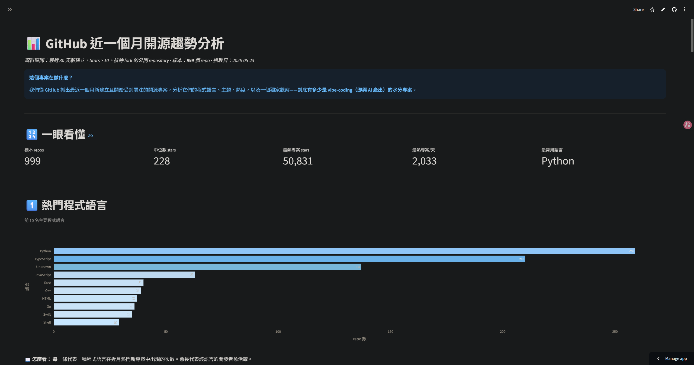

# 📊 GitHub 近一個月開源趨勢分析

> 抓取 GitHub 最近 30 天新建立的熱門 repository，用規則式分類器歸類並做視覺化分析，**並獨家加入「公開 metadata 完整度風險評分」量化指標**。

<p align="center">
  <a href="https://apprecenttrendanalysiz-kn98grjnkut85j6dvxzfhb.streamlit.app">
    
  </a>
  <br>
  <em>↑ 點圖直接開互動 dashboard</em>
</p>

<p align="center">
  <a href="https://github.com/aionyx02/github_recent_trend_analysiz/actions/workflows/python-tests.yml"></a>
  <a href="https://github.com/aionyx02/github_recent_trend_analysiz/actions/workflows/docs-guard.yml"></a>
  <a href="https://apprecenttrendanalysiz-kn98grjnkut85j6dvxzfhb.streamlit.app"></a>
  
  
  
  
  
</p>

---

## 📌 TL;DR — 30 秒看完

從 GitHub 近 30 天 trending 抽 **1000 個 repo**，發現：

1. **AI 全面壓倒** — `claude-code` / `ai-agents` / `llm` 等 topic 霸榜；分類後 **AI/ML + Other 占 76.4%**，傳統 Web/Data/DevOps 加起來不到 22%；新獨立出的 **Finance/Trading 類占 4.5%**（45 筆），呈現「AI 主導 + 加密交易長尾」結構。
2. **被星 ≠ 被用** — Stars↔Forks 只有中度相關 (Pearson 0.36)，AI/ML 類 fork:star 僅 18%（典型「被星沒人用」），而 Finance/Trading 類 **fork:star 高達 767%**（median 9.9×）— 反向極端，疑似自動化 fork-farming，詳見 §4 與 §限制與威脅。
3. **🔬 原創貢獻**：用 8 訊號的**公開 metadata 完整度風險評分**量化「stars 相對於可見 metadata 訊號偏稀疏」的程度，1.8% 落入 **低資訊密度** 候選 tier，**集中在 1000-5000 stars** 級距 (9.9%)。

技術上：Python 3.11+ + pandas + matplotlib + Streamlit + GitHub Actions 每日自動重抓，全程 38 個 pytest + ruff + 三道 CI guard 把關。

---

## 🌐 線上 Demo

👉 **<https://apprecenttrendanalysiz-kn98grjnkut85j6dvxzfhb.streamlit.app>** ← 直接開瀏覽器點，不用 clone

不裝任何東西就能：
- 用側欄篩選 1000 個 repo（分類、語言、最低 stars）
- 看 7 張互動 Plotly 圖（hover 顯示精確數值、可縮放）
- 滑到底看 metadata 完整度分析（含完整 Top 15 + 高關注低描述名單）
- 任一 repo 名稱可點，直接跳 GitHub

> _部署在 Streamlit Community Cloud 免費方案。閒置一段時間會自動 sleep，第一次點開可能需要 ~10 秒喚醒。_
>
> _📅 資料每天 14:00 (Taipei) 由 GitHub Actions 自動重抓最近 30 天 snapshot，commit 後 Streamlit Cloud ~30 秒內自動 redeploy。_

---

## 📑 目錄

- [一句話總結](#一句話總結)
- [🎯 三個關鍵發現](#-三個關鍵發現)
- [🔬 原創貢獻：公開 Metadata 完整度分析](#-原創貢獻公開-metadata-完整度分析)
- [📊 完整圖表結果](#-完整圖表結果)
- [⚙️ 快速開始](#️-快速開始)
- [🏗️ 架構](#️-架構)
- [📁 檔案結構](#-檔案結構)
- [⚠️ 已知限制](#️-已知限制)
- [📜 授權](#-授權)

---

## 一句話總結

> 在 1000 個近月熱門 GitHub repo 中，**76.4% 落在 AI/ML 或 Other 兩大桶**、新獨立出的 **Finance/Trading 類占 4.5%** 且呈現異常高 fork:star 比例（median 9.9×，疑似 fork-farming）、Stars↔Forks 整體相關性只有 0.35（中度），而**1.8% 落入「低資訊密度」候選 tier**（公開 metadata 訊號相對於 stars 偏稀疏），集中在 1000-5000 stars 級距。

---

## 🎯 三個關鍵發現

### 1️⃣ 2026 開源 trending：AI 主導 + 加密交易暗流 + 長尾

| 分類 | 比例 |
|---|---:|
| **AI/ML** | **38.9%** |
| Other（仍無法歸類） | 37.5% |
| Web | 5.0% |
| **Finance/Trading**（本輪新獨立） | **4.5%** |
| Mobile | 4.2% |
| CLI + Game + Security + Data + DevOps | 9.9% |

→ AI/ML + Other 加起來 **76.4%**；本輪新拉出 **Finance/Trading 類（45 筆）**，主要是 polymarket / arbitrage 套利機器人聚落，從原本被埋沒在 Other 桶釋出。其餘 7 個傳統類別合計不到 22%。

> 分類規則更新詳見 [ADR-0004 Revision Log](docs/adr/0004-rule-based-classification.md#revision-log)。

### 2️⃣ Stars 與 Forks 的相關性沒想像中強

- Pearson **0.35** / Spearman **0.43** — 中度正相關
- 平均 stars **481** vs 中位數 **227** — 平均被少數爆紅專案拉抬 **2.1 倍**
- → 結論用中位數比平均數更貼近真實

### 3️⃣ Fork:star 比例呈現**極端兩極化**

| 類別 | 平均 stars | 平均 forks | fork:star |
|---|---:|---:|---:|
| **Finance/Trading** | 223 | **1711** | **767%** 🚩 |
| Other | 390 | 109 | 28% |
| Web | 397 | 107 | 27% |
| **AI/ML** | **602** | **106** | **18%** |
| Mobile | 402 | 23 | 6% |

→ 兩個截然相反的模式：
> - **AI/ML 類**：高 stars 低 forks（18%）— 「被星但少被用」，符合 vibe-coding 的薄 README 樣態。
> - **Finance/Trading 類**：低 stars 但 forks 異常高（767%，median 9.9×）— 沒有正常 repo 有 30× forks vs stars，**疑似自動化 fork-farming / astroturfing**。Top 5 polymarket 套利 bot 的 forks 全部超過 3000，stars 卻只有兩三百，pattern 非常一致。值得單獨一節調查（見 §限制與威脅 B.7）。

---

## 🔬 原創貢獻：公開 Metadata 完整度分析

### 動機

GitHub trending 中有相當數量的 repo 呈現「stars 高、但公開 metadata 訊號偏稀疏」的型態 —— 沒有 description、沒有 license、沒有 topics、forks 與 stars 嚴重失衡。我們把這個現象量化為 **公開 metadata 完整度風險評分 (Metadata Completeness Risk Score)**：

> **定義**：用 8 個訊號量化 repo 公開 metadata 相對於 stars 的稀疏程度。**高分代表訊號可疑，不代表該 repo 一定無價值** —— `awesome-*` 列表、學術 repo、官方快速釋出 repo 都可能踩到訊號。指標衡量的是公開產出，不衡量作者本人，也不是對 vibe-coding 這個編程方式的評價。

### 評分機制（0-10 分，8 個加權訊號）

| 訊號類別 | 訊號 | 最高加分 |
|---|---|---:|
| Description | 空、< 20 字 | +3 |
| License | 未宣告 | +1 |
| Stars × Description 交互 | stars > 1000 且 description 空 | +2 |
| Stars × Forks 交互 | stars > 500 且 fork:star < 2% | +2 |
| 速度 | stars/day > 300 且 age < 7 天 | +1 |
| 命名 | 含 generic AI buzzword | +1 |
| Topics | 完全沒貼 topic | +1 |

**Tier 判定**：0-2 **訊號完整** · 3-4 **待檢視** · **5+ 低資訊密度**

完整訊號定義、計分邏輯與假陽性案例見 [`outputs/vibe_coding_analysis.md`](outputs/vibe_coding_analysis.md)。

### 結果

| Tier | 數量 | 比例 |
|---|---:|---:|
| 🟢 訊號完整 (signals complete) | 849 | 85.0% |
| 🟡 待檢視 (needs review) | 132 | 13.2% |
| 🔴 **低資訊密度 (low-information-density)** | **18** | **1.8%** |

### 🎯 核心發現：低資訊密度集中於 1000-5000 stars 級距

| Stars 級距 | 樣本 | 低資訊密度 % |
|---|---:|---:|
| ≥10000 | 3 | 0.0% |
| 5000-9999 | 2 | 50.0% (樣本小，需謹慎詮釋) |
| **1000-4999** | **71** | **9.9%** ← 集中區 |
| 500-999 | 108 | 1.9% |
| 100-499 | 815 | 1.0% |

> 高端（≥10000）受到較多檢視；低端（<500）關注度低，metadata 風險訊號不易被觀察。**中段 1k-5k 是訊號集中區**，可能反映「足以上 trending、又不會被嚴格審視」的區段。請注意這是觀察性結論，不是因果推論。

### Top 7 最高分專案

| Rank | Repo | Stars | Forks | Age | 分數 |
|---:|---|---:|---:|---:|---:|
| 1 | `thananon/9arm-skills` | 1918 | 255 | 3d | **8** |
| 2 | `cursor/cookbook` | 3843 | 446 | 26d | **7** |
| 3 | `deepseek-ai/awesome-deepseek-agent` | 2145 | 234 | 26d | **7** |
| 4 | `FoundZiGu/GuJumpgate` | 2143 | 612 | 4d | **6** |
| 5 | `wrongly-cuddly-obsession/NTSB_FOIA_MU5735` | 1070 | 366 | 23d | **6** |
| 6 | `V4bel/dirtyfrag` | 4752 | 755 | 16d | **6** |
| 7 | `Ch1rpy2613/Mirrai` | 806 | 11 | 18d | **6** |

> 名單中包含 `cursor/cookbook`、`deepseek-ai/awesome-*` 等**官方/知名組織帳號** —— 反映的並非惡意行為，而是 2026 AI 公司「先發再說」的快速出貨文化在 metadata 完整度層面的體現。

完整報告：[`outputs/vibe_coding_analysis.md`](outputs/vibe_coding_analysis.md)

---

## 📊 完整圖表結果

### 1. 熱門程式語言（前 10）


**怎麼看**：每一條代表一種主要程式語言在近月熱門新專案中出現的次數。
**重點**：Python 一馬當先（34%），TypeScript / JavaScript 緊追，C/C++/Rust/Go/Swift 形成第二梯隊。前 3 名加總已占約 63%。

### 2. 熱門主題標籤（前 20）


**怎麼看**：topic 是專案作者自貼的標籤。`claude-code` (52)、`ai-agents` (43)、`llm` (34)、`claude` (29)、`mcp` (26)、`codex` (25) 霸榜，印證 2026 上半年仍是 LLM / AI agent 應用爆炸期。也藏一個 `trading-bot` / `polymarket` 的金融自動化小爆紅。

⚠️ **注意**：**54.4% 的 repo 完全沒貼任何 topic**，這是這份資料的結構性問題。

### 3. Stars 分布（直方圖 + 對數座標）


**怎麼看**：Y 軸是對數，意思是相隔一格代表 10 倍差距。長尾愈長代表少數爆紅專案拉開差距。
**重點**：絕大多數熱門 repo 集中在 100-1000 stars 區間，>10000 只有 3 個（nexu-io/open-design、antirez/ds4、Yuan1z0825/nature-skills）。

### 4. Stars vs Forks 散佈圖


**怎麼看**：每點是一個 repo，兩軸都是對數。對角線方向走就代表 stars 和 forks 一起長。
**重點**：呈現中度正相關（Pearson 0.36），但散佈面積大 —— **stars 高 ≠ forks 一定高**。AI/ML 類有明顯一群「stars 高但 forks 偏低」的點。

### 5. 專案分類分布


**怎麼看**：用關鍵字規則歸類後的結果。優先順序：AI/ML > Security > DevOps > Data > Web > Mobile > Game > CLI/Tooling > Other。
**重點**：AI/ML (389) + Other (375) = **76.4%**；本輪新增 Finance/Trading 類 (45)；剩餘 7 類合計 < 22%。

### 6. 各類別平均 Stars


**怎麼看**：每類別的平均 stars 比較。
**重點**：Game 平均最高 (754)，但被 antirez/ds4 異常值拉抬，看中位數較中肯。Data (12 個樣本) 中位數最高 (316)，少而精。

### 7. 每日新增熱門 repo 數（30 天時序）


**怎麼看**：當日有幾個「最終熱門起來」的 repo 在這天建立。
**重點**：每天平均約 4 個，最高 10 個，沒有明顯爆量 —— 熱門專案是「持續產出」而非集中於某波發表會。

---

## ⚙️ 快速開始

### 前置需求

- Python **3.11+**（開發環境為 3.14；CI 在 3.14 上跑測試。`>=3.11` 是相容下限，能涵蓋大多數老師 / 同學的本機環境）
- GitHub Personal Access Token（只需 `public_repo` 讀取權限）

### 安裝

```powershell
# 1. clone 後進入專案目錄
git clone <repo-url> github_recent_trend_analysiz
cd github_recent_trend_analysiz

# 2. 建虛擬環境並安裝依賴
python -m venv .venv
.venv\Scripts\Activate.ps1
pip install -e ".[dev]"

# 3. 設定 GitHub Token（產一個：https://github.com/settings/tokens）
cp .env.example .env
# 編輯 .env，填入 GITHUB_TOKEN=ghp_xxx
```

### 跑完整 pipeline（約 35-40 分鐘，含 GitHub API 抓取）

```powershell
# Stage 1-4：抓 search + languages + topics，產 CSV
.venv\Scripts\python.exe -m src.collect_all

# Stage 5：分類 + 7 張圖 + summary
.venv\Scripts\python.exe -m src.build_charts

# 額外：公開 metadata 完整度風險評分
.venv\Scripts\python.exe -m src.analyze_vibe

# 額外：Other 類別深入分析（top languages / keywords / topics + 候選新分類）
.venv\Scripts\python.exe -m src.analyze_other
```

### 跑 Streamlit Dashboard（互動式探索）

```powershell
.venv\Scripts\streamlit run dashboard/app.py
```

開啟 <http://localhost:8501>

### 跑單元測試

```powershell
.venv\Scripts\python.exe -m pytest -q
```

期望結果：**38 tests passed**

### 產生「人工驗證樣本」（給審閱者覆核分類與 metadata 評分用）

```powershell
# 50 筆規則式分類驗證樣本（每類別 ~5 筆 stratified random）
.venv\Scripts\python.exe -m src.prepare_classification_validation

# 58 筆 metadata 完整度評分驗證樣本（每 tier ~20 筆 stratified）
.venv\Scripts\python.exe -m src.prepare_vibe_validation
```

兩個樣本檔都使用 `utf-8-sig`，Excel / Google Sheets 直接打開即可看到中文。
人工標註欄位：`agree` 填 TP/FP/?，`correct_category` 給 FP 寫正確類別，`notes` 寫一句話。
完成後可計算每個類別 / tier 的一致率（agreement rate）回填到 §限制與威脅。

---

## 🏗️ 架構

```
GitHub REST API
       │
       ▼
src.collect_repos        ───►  data/raw/search_*.json
src.collect_languages    ───►  data/raw/languages/<id>.json
src.collect_topics       ───►  data/raw/topics/<id>.json
       │
       ▼
src.clean_data           ───►  data/processed/repos.csv
                              data/processed/repo_languages.csv
                              data/processed/repo_topics.csv
       │
       ▼
src.classify             ───►  repos.csv (+ category 欄)
       │
       ▼
src.visualize            ───►  outputs/figures/*.png
src.analyze_vibe         ───►  outputs/vibe_coding_analysis.md
       │
       ▼
dashboard/app.py         ───►  http://localhost:8501  (Streamlit)
```

每個 stage 寫到磁碟才進下一步，**raw 層永遠 immutable**、processed 層可重建。

---

## 📖 Data Dictionary

主資料表 `data/processed/repos.csv`（999 列 × 19 欄）的關鍵欄位來源與計算方式：

### 識別 / Identifier

| 欄位 | 來源 | 定義 |
|---|---|---|
| `id` | GitHub API | repo 的 GitHub 內部數字 ID（唯一） |
| `full_name` | GitHub API | `owner/repo` 格式 |
| `owner` | GitHub API | repo 擁有者帳號（user 或 org） |
| `name` | GitHub API | repo 名稱 |
| `html_url` | GitHub API | `https://github.com/owner/repo` |

### 描述 / Descriptive

| 欄位 | 來源 | 定義 |
|---|---|---|
| `description` | GitHub API | 作者填的一行 description；空值在 `clean_data` 填為 `""` |
| `primary_language` | GitHub API | 字元數最多的語言；空值填為 `"Unknown"` |
| `license` | GitHub API | SPDX 識別碼；無 license 時為 `"None"` 或 `"NOASSERTION"` |
| `size` | GitHub API | repo 大小（KB） |

### 時間 / Time

| 欄位 | 來源 | 定義 |
|---|---|---|
| `created_at` | GitHub API | repo 建立 timestamp（UTC, ISO 8601） |
| `pushed_at` | GitHub API | 最後一次 push timestamp（UTC, ISO 8601） |

### 熱度 / Popularity

| 欄位 | 來源 | 定義 |
|---|---|---|
| `stars` | GitHub API | `stargazers_count` |
| `forks` | GitHub API | `forks_count` |
| `watchers` | GitHub API | ⚠️ Search API 不回 `subscribers_count`，此欄等於 `stars`，**分析應避免使用** |
| `open_issues` | GitHub API | `open_issues_count`（含 PR） |

### 衍生 / Derived (在 `src/clean_data.py` 計算)

| 欄位 | 公式 | 用途 |
|---|---|---|
| `age_days` | `max((run_date - created_at).days, 1)` | repo 已存在天數；下限 1 避免除以 0 |
| `stars_per_day` | `stars / age_days` | 短期關注速度；用於辨識「隔夜暴衝」 |
| `fork_star_ratio` | `forks / max(stars, 1)` | 「被星但少被 fork」訊號；低於 2% 在 metadata 評分計分 |
| `issue_star_ratio` | `open_issues / max(stars, 1)` | 活躍度補助指標；目前未進入主分析 |

### 分類 / Classification (在 `src/classify.py` 計算)

| 欄位 | 來源 | 定義 |
|---|---|---|
| `category` | 規則式分類器 | 10 大類別之一（AI/ML, Security, Finance/Trading, DevOps, Data, Web, Mobile, Game, CLI/Tooling, Other）；單一分類，優先順序匹配；2026-05-25 ADR-0004 修訂新增 Finance/Trading 類 |

### Metadata 完整度評分 (在 `data/processed/vibe_scores.csv`)

| 欄位 | 範圍 / 公式 | 定義 |
|---|---|---|
| `score` | 0-10（整數） | 8 訊號加權總分；高分代表公開 metadata 訊號偏稀疏，詳見 [`outputs/vibe_coding_analysis.md`](outputs/vibe_coding_analysis.md) |
| `tier` | `訊號完整` / `待檢視` / `低資訊密度` | 0-2 / 3-4 / 5+ |
| `reasons` | 逗號分隔字串 | 列出實際觸發的訊號名稱（如 `desc:empty, license:none, high-attention-no-desc`） |

### 長表 / Long-format tables

- `repo_languages.csv` — 一個 repo 多列；每列一個 (repo_id, language, bytes)
- `repo_topics.csv` — 一個 repo 0~多列；每列一個 (repo_id, topic)

---

## 📁 檔案結構

```
github_recent_trend_analysiz/
├── README.md                       ← 你正在看
├── pyproject.toml                  ← 依賴 & Python 版本下限
├── .env.example                    ← GITHUB_TOKEN 範本
├── src/                            ← Pipeline (config, collect_*, clean, classify, visualize, analyze_*)
├── dashboard/app.py                ← Streamlit 互動 dashboard
├── tests/                          ← 38 個 pytest
├── data/
│   ├── raw/                        ← gitignored，原始 API 回應
│   └── processed/                  ← repos.csv + 衍生 CSV + 評分檔
├── outputs/                        ← figures/ + summary_stats.md + 兩份分析報告
└── docs/                           ← 設計文件 (architecture, ADR, 開發 session log)
```

各模組詳細職責見 [`docs/architecture.md`](docs/architecture.md)，
分類器設計理由見 [ADR-0004](docs/adr/0004-rule-based-classification.md)。

---

## ⚠️ 限制與威脅 (Limitations & Threats to Validity)

本研究將限制分為三類，便於審閱者快速判斷結論的適用邊界。

### A. 資料限制 (Data limitations)

1. **GitHub Search API 1000 筆硬上限** — 單次查詢最多回 1000 筆，本研究抓滿。實際符合 `stars:>10 fork:false` 的 30 天 repo 約 9286 筆，未抓的 8000+ 筆 stars 都較低，對「熱門 trending」結論影響有限，但**不應外推為「整個 GitHub 生態」**。
2. **54.4% repo 無 topics** — 是 GitHub 生態的結構性現象（topic 為選填欄位），不是抓取錯誤。導致 topic-based 的趨勢分析只代表「有貼標籤的子集合」，Other 桶占 37.5% 部分源於此（本輪 ADR-0004 修訂後從 42.0% 降到 37.5%）。
3. **`watchers` 欄等於 `stars`** — GitHub Search API 不回 `subscribers_count`，已知 API 限制。所有分析已避免使用 `watchers` 欄。

### B. 方法限制 (Method limitations)

4. **規則式分類器、單一分類** — keyword 表手寫，主觀性與覆蓋率限制詳見 [ADR-0004](docs/adr/0004-rule-based-classification.md)。一個 repo 僅歸一類，React+LLM 的 repo 會優先歸 AI/ML（優先順序高）而非 Web，**可能系統性高估 AI/ML 類別占比，低估 Web/Mobile 等被「吞掉」的類別**。本輪修訂已部分修補（新增 Finance/Trading 類 + 補齊 `claude-code`/`mcp`/`codex`/`shadcn`/`tailwindcss`/`swiftui`/`oauth` 等現代 stack keyword，見 ADR-0004 Revision Log），仍有待人工驗證。
5. **分類結果未經人工抽樣驗證** — 目前無法提供 precision/recall 數字。已 scaffold 隨機 50 筆驗證樣本於 `data/processed/classification_validation_sample.csv`（10 類 × 5 筆 stratified），待人工標註後回填一致率。
6. **Metadata 完整度分數是「訊號」不是「判決」** — 高分代表公開 metadata 訊號偏稀疏，**不代表該 repo 一定無價值**。`awesome-*` 列表、學術研究 repo、官方快速釋出 repo 都可能踩到訊號。指標衡量公開產出，不衡量作者本人，也不是對 vibe-coding 此編程方式本身的評斷。precision/recall 待後續人工驗證（樣本見 `data/processed/vibe_validation_sample.csv`）。
7. **Finance/Trading 類 fork:star 異常 = 疑似 fork-farming，需獨立調查** — 本輪 ADR-0004 修訂後浮現的新訊號：Finance/Trading 類 45 個 repo 的 median fork:star = 9.9×（top 5 polymarket bot 都超過 30×），與其他類別正常 5-30% 區間極端背離。可能解釋：(a) 自動化 fork-farming 提升曝光、(b) 「下載 → fork 自己改」的真實部署 pattern、(c) GitHub 演算法異常。本研究**無法區分上述三種解釋**，但建議讀者對該類數據保留警戒，不要把 forks 數當作真實採用量。後續可比對 fork 帳號的建立時間、commit history 等深入驗證。

### C. 外推限制 (External validity)

8. **30 天時間窗** — 本研究僅刻畫「2026-04-24 ~ 2026-05-24 這一個 snapshot」，**不能外推為「GitHub 長期趨勢」**。daily-refresh 累積 7 天後可做短期 delta 分析（規劃中），但跨季 / 跨年趨勢需要重新設計收集策略。
9. **`stars > 10` 篩選** — 我們只看「已開始受到關注」的 repo，**不能代表所有新建立 repo**。stars ≤ 10 的長尾未在樣本內。
10. **Stars 不能代表程式碼品質或實際使用量** — 全部數值僅反映「社群關注度訊號」。fork:star、issue:star 等衍生比例提供補充視角，但都不是品質的直接量測。

---

## 📜 授權

MIT License

本專案為大數據導論課程作業。資料來源為 GitHub 官方 REST API 的公開資料。

---

## 🙏 致謝

- 原始企畫由作者撰寫（見 `github_recent_trend_analysis_project_proposal.md`）
- Context-engineering 文件系統採用 [context-engineering-template](docs/) 模板
- AI 協作：Claude Opus 4.7（規格實作、ADR 草擬、metadata 完整度評分機制設計）